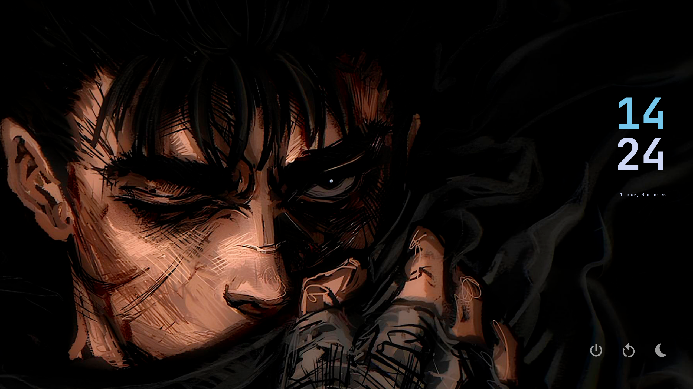
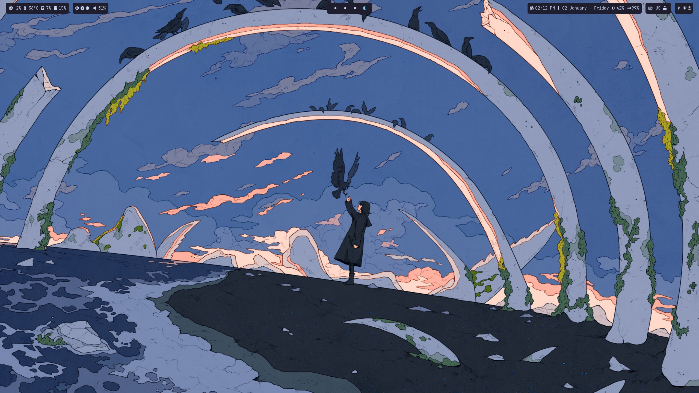
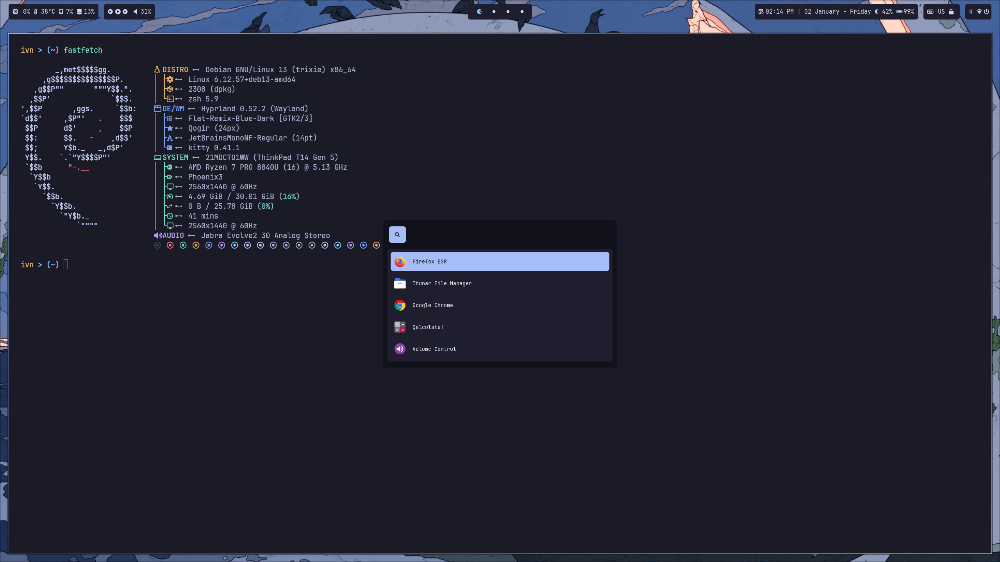
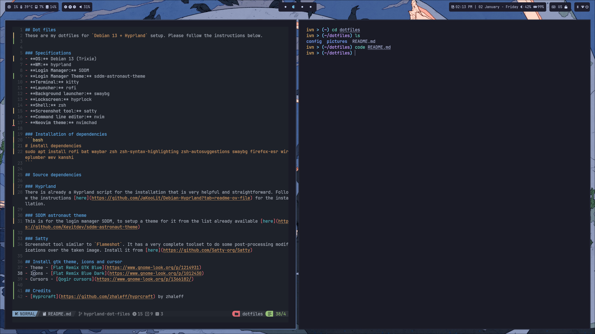
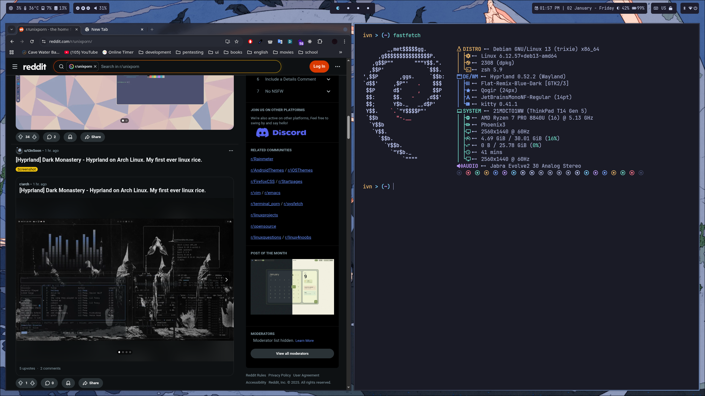

## Dot files
These are my dotfiles for `Debian 13 + Hyprland` setup. Please follow the instructions below.







### Specifications
- **OS:** Debian 13 (Trixie)
- **WM:** hyprland
- **Login Manager:** SDDM
- **Login Manager Theme:** sddm-astronaut-theme
- **Terminal:** kitty
- **Launcher:** rofi
- **Background launcher:** swaybg
- **Lockscreen:** hyprlock
- **Shell:** zsh
- **Screenshot tool:** satty
- **Command line editor:** nvim
- **Neovim theme:** nvimchad

### Installation of dependencies
```bash
# install dependencies
sudo apt install rofi bat waybar zsh zsh-syntax-highlighting zsh-autosuggestions swaybg firefox-esr wireplumber wev kanshi
```

## Source dependencies

### Hyprland
There is already a Hyprland script for the installation that is very helpful and straightforward. Follow the instructions [here](https://github.com/JaKooLit/Debian-Hyprland?tab=readme-ov-file) for the installation. 

### SDDM astronaut theme
This is for the login manager SDDM, to setup a theme for it from the list already available [here](https://github.com/Keyitdev/sddm-astronaut-theme)

### Satty
Screenshot tool similar to `Flameshot`. It has a very complete toolset to do some post-processing modifications over the taken image. Install it from [here](https://github.com/Satty-org/Satty)

## Install gtk theme, icons and cursor
- Theme - [Flat Remix GTK Blue](https://www.gnome-look.org/p/1214931)
- Icons - [Flat Remix Blue Dark](https://www.gnome-look.org/p/1012430)
- Cursors - [Qogir cursors](https://www.gnome-look.org/p/1366182/)

## Credits
- [Hyprcraft](https://github.com/zhaleff/hyprcraft) by @zhaleff