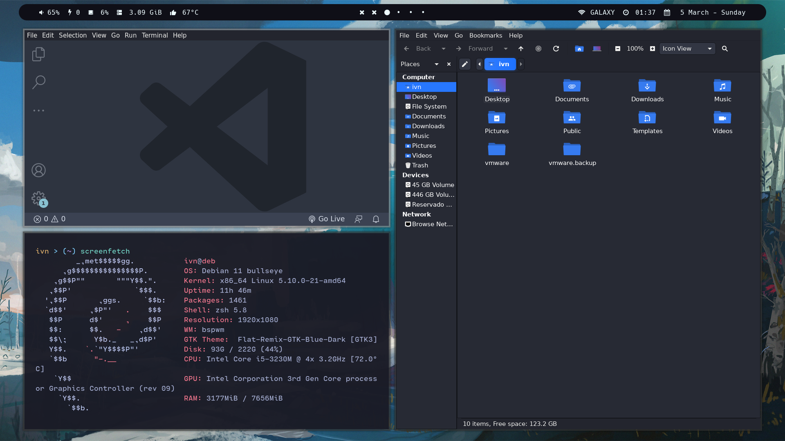

# Debian 10 Setup
This is the guide step by step to configure the setup on Debian.




---

## Dependencies
* **Window Manager (WM):** bspwm
* **Shell:** zsh
* **HotKey Daemon:** sxhkd
* **Terminal:** kitty
* **Compositor:** picom
* **Widgets:** polybar
* **Application launcher:** rofi
* **Lock Screen:** betterlockscreen
* **Image viewer:** feh
* **ScreenShot tool:** flameshot
* **Command line editor:** neo vim
* **Vim theme:** Nvim Chad
* **Syntax highlight:** zsh-syntax-highlighting
* **Prompt autosuggestions:** zsh-autosuggestions
* **Terminal multiplexer:** tmux

## Install dependencies
Paste the following code in your terminal in order to install some dependencies:
```sh
sudo apt install bspwm sxhkd kitty zsh flameshot rofi feh git neovim zsh-syntax-highlighting zsh-autosuggestions tmux
```

There some tools that can't be installed by apt manager, so it's necesary to compile from source the following dependencies:
* [picom](https://github.com/yshui/picom) (This package can be found on Debian 11 - Bulleye)
* [betterlockscreen](https://github.com/betterlockscreen/betterlockscreen) (First install i3lock-color and imagemagick)
* [polybar](https://github.com/polybar/polybar/wiki/Compiling) (This package can be found on Debian 11 - Bulleye)

> If you want to install [NvChad](https://nvchad.github.io/getting-started/setup) is necessary the 0.6 version of Neo Vim [(Install here)](https://github.com/neovim/neovim/releases/tag/v0.6.1)

> If you want to install themes for tmux get [tpm](https://github.com/tmux-plugins/tpm)

## Install fonts
* [Hack Nerd Font](https://www.nerdfonts.com/font-downloads) (For polybar)
* [Cartograph CF](https://en.bestfonts.pro/font/cartograph-cf) (For rofi and kitty)

## Install gtk theme, icons and cursor
* Theme - [Flat Remix GTK Blue](https://www.gnome-look.org/p/1214931) 
* Icons - [Flat Remix Blue Dark](https://www.gnome-look.org/p/1012430)
* Cursors - [Qogir cursors](https://www.gnome-look.org/p/1366182/)

---

## Copy dot files
```sh
# Clone the repository
git clone https://github.com/ivndot/dotfiles.git 
# Enter directory
cd dotfiles
# Copy dot files 
cp -r config/* $HOME/.config/
# Copy tmux.conf and zshrc
cp .tmux.conf .zshrc $HOME/
```
Reboot the machine
```
sudo reboot now
```

## Credits
* [rxyhn](https://github.com/rxyhn/bspdots)
* [Tanish2002](https://github.com/Tanish2002/dot-files)